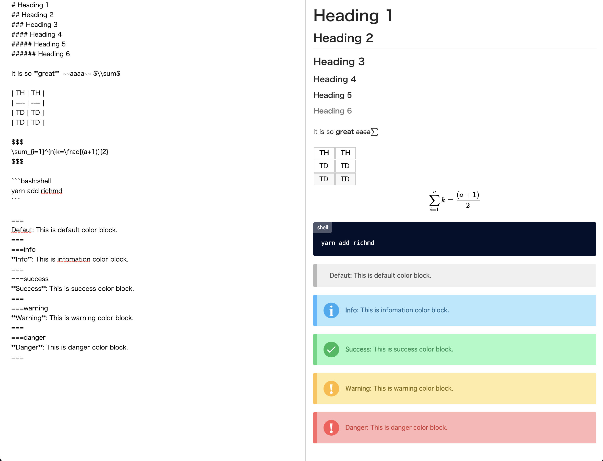

# RichMD


## What is RichMD?
RichMD is a tool for making Markdown richer.



## Installation

```bash
# use npm
$ npm install richmd

# use yarn
$ yarn add richmd
```

## Usage
- [Usage for React](./docs/usage-react.md)
- [Usage for Vue](./docs/usage-vue.md)
- [Usage Webpack](./docs/Setup-webpack.md)


## Markdown Syntax
Please read a [RichMD Markdown Syntax Documentation](./docs/md-syntax.md).

### Suport syntax
- strong
- italic
- image
- link
- headings
- horizontal rule
- blockquote
- unordeed list
- ordered list
- strikethrough
- code block
- checkbox list
- table
- TeX syntax(Use [KaTeX](https://katex.org/))
- Color Inline Block
- Dropdown details
- Import CSS file(Only RichMD file is supported)
- Custom HTML Tag(Only RichMD file is supported)
- Video(HTML5 Video Tag)
### To be implemented in a future release
- Slide view mode

## License
MIT

## Thank you :pray:
- [Markdown-tree-parser](https://github.com/ysugimoto/markdown-tree-parser)
  - RichMD markdown parser was created using the code in markdown-tree-parser as a reference.
- [KaTeX](https://github.com/KaTeX/KaTeX)
- [highlight.js](https://github.com/highlightjs/highlight.js/)
