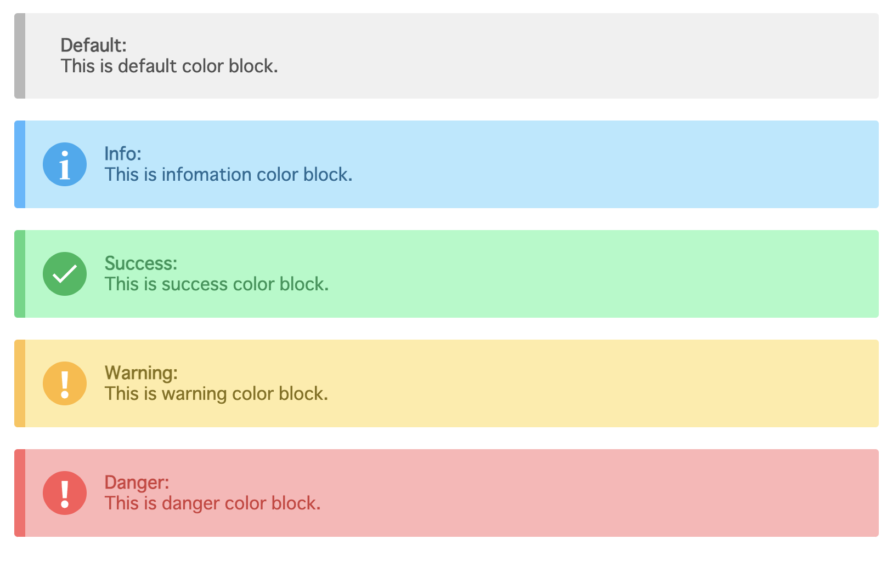

# RichMD Markdown Syntax
## Basic Markdown Syntax
### Heading
```markdown
# heading 1
## heading 2
### heading 3
#### heading 4
##### heading 5
###### heading 6
```

### Strong
```markdown
**strong**
```

### Italic
```markdown
*strong*
```

### Strike Through
```markdown
~~strong~~
```

### Image
```markdown

```

### Link
```markdown
[name](path)
```

### List
```markdown
- list1
- list2
- list3
```

### Ordered List
```markdown
1. list1
2. list2
3. list3
```

### Checklist
```markdown
- [ ] checklist
- [ ] checklist
- [x] checklist
```

### Blockquote
```markdown
> Blockquote
```

### Horizonal
```markdown
---
```

### Inline Code
```markdown
`Inline code`
```

### Code Block
~~~markdown
```
Code block
```
~~~

#### Enable Language syntax
~~~markdown
```js
console.log('Hello World!')
```
~~~

It can display filename in code block.
~~~markdown
```js:main.js
console.log('Hello World!')
```
~~~

It use [highlight.js](https://github.com/highlightjs/highlight.js) code syntax support. 
Please code syntax support details read a [highlight.js Documentation](https://highlightjs.org/static/demo/).

### Table
```markdown
| TH | TH |
|----|----|
| TD | TD |
```

## Original Markdown Syntax
### Mathematical formula Block (Use [KaTeX](https://katex.org/))
Please TeX Syntax details read a [KaTeX Functions Documentation](https://katex.org/docs/supported.html).

#### Syntax
```txt
$$$
\frac{a}{b}
$$$
```

#### Preview


### Inline Mathematical formula
#### Syntax
```txt
This is $a=b+c$
```

#### Preview


### Color Block
#### Syntax
```txt
===
**Default**:
This is default color block.
===
===primary
**Primary**:
This is primary color block.
===
===success
**Success**:
This is success color block.
===
===warning
**Warning**:
This is warning color block.
===
===danger
**Danger**:
This is danger color block.
===
```
#### Preview

