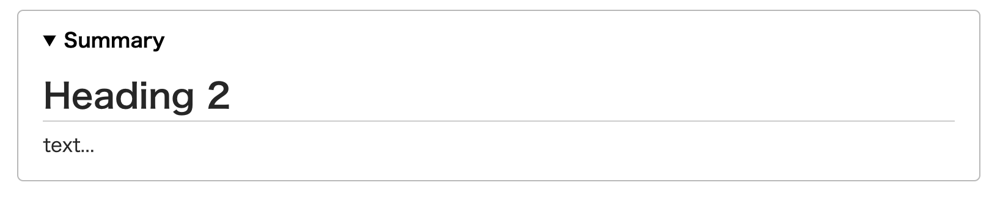

# Richmd Markdown Syntax
## Basic Markdown Syntax
### Heading
```markdown
# heading 1
## heading 2
### heading 3
#### heading 4
##### heading 5
###### heading 6
```

### Strong
```markdown
**strong**
```

### Italic
```markdown
*strong*
```

### Strong + Italic
```markdown
***strong***
```

### Strike Through
```markdown
~~strong~~
```

### Image
```markdown

```

### Link
```markdown
[name](path)
```

### List
```markdown
- list1
- list2
- list3
```

### Ordered List
```markdown
1. list1
2. list2
3. list3
```

### Checklist
```markdown
- [ ] checklist
- [ ] checklist
- [x] checklist
```

### Blockquote
```markdown
> Blockquote
```

### Horizonal
```markdown
---
```

### Inline Code
```markdown
`Inline code`
```

### Code Block
~~~markdown
```
Code block
```
~~~

#### Enable Language Syntax
~~~markdown
```js
console.log('Hello World!')
```
~~~

It can display filename in code block.
~~~markdown
```js:main.js
console.log('Hello World!')
```
~~~

It uses [highlight.js](https://github.com/highlightjs/highlight.js) for code syntax support. 
Please read [highlight.js Documentation](https://highlightjs.org/static/demo/) for details.

### Table
```markdown
| TH | TH |
|----|----|
| TD | TD |
```

## Original Markdown Syntax
### Mathematical Formula Block (using [KaTeX](https://katex.org/))
Please read [KaTeX Functions Documentation](https://katex.org/docs/supported.html) for TeX syntax details.

#### Syntax
```txt
$$
\frac{a}{b}
$$
```

or

```txt
$$ \frac{a}{b} $$
```

#### Preview


### Inline Mathematical Formula
#### Syntax
```txt
This is $a=b+c$
```

#### Preview


### Color Block
#### Syntax
```txt
===
**Default**:
This is default color block.
===
===info
**Infomation**:
This is Infomation color block.
===
===success
**Success**:
This is success color block.
===
===warning
**Warning**:
This is warning color block.
===
===danger
**Danger**:
This is danger color block.
===
```
#### Preview


### Dropdown Details
#### Syntax
```txt
:>Summary
text...
:>
```
#### Preview


### Video(HTML5 Video Tag)
#### Syntax
```txt
@[movie](./movie.mp4)
```

### Custom HTML Tag
It creaties custom HTML Tag.
(defalut tag `span`)

#### Syntax
```txt
::<Tag Name>[.ClassName]

::
```

#### Example
```txt
::menu
menu
::

::article.className
article
::

::div
div
::

# only className
::.className
only Class
::
```
##### Preview
```html
<menu>
<span class="span">menu</span>
</menu>

<article class="className">
<span class="span">article</span>
</article>

<div>
<span class="span">div</span>
</div>
```
