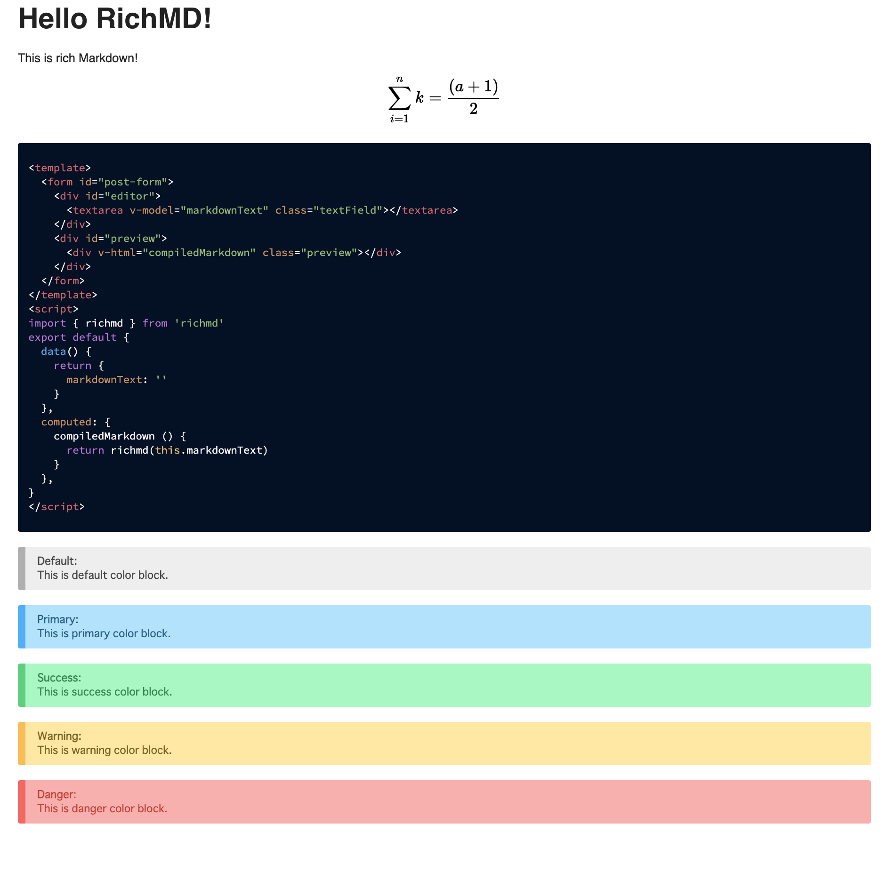

# Usage the `richmd` command
## RichMD file

RichMD has created a new file extension `.richmd`.

With the creation of this extension, the possibilities for RichMD are greatly expanded.
From now on, we are planning to develop around the RichMD file.

```bash
# Create Richmd file
$ touch hello.richmd
```

## Simple usage
First, create a RichMD file. 

```txt
$ touch ./hello.richmd
```

Write the following code.

~~~txt
# Hello RichMD!
This is rich Markdown!

$$$
\sum_{i=1}^{n} k=\frac{(a+1)}{2}
$$$

```js
<template>
  <form id="post-form">
    <div id="editor">
      <textarea v-model="markdownText" class="textField"></textarea>
    </div>
    <div id="preview">
      <div v-html="compiledMarkdown" class="preview"></div>
    </div>
  </form>
</template>
<script>
import { richmd } from 'richmd'

export default {
  data() {
    return {
      markdownText: ''
    }
  },
  computed: {
    compiledMarkdown () {
      return richmd(this.markdownText)
    }
  },
}
</script>
```
===
**Default**:
This is default color block.
===
===primary
**Primary**:
This is primary color block.
===
===success
**Success**:
This is success color block.
===
===warning
**Warning**:
This is warning color block.
===
===danger
**Danger**:
This is danger color block.
===

~~~

Then, Run the `richmd` command.

```txt
$ richmd ./hello.richmd
```

To specify the output directory, add the `-d` option.

```txt
$ richmd -d [path] ./hello.richmd
```

The output will be `hello.html`. Open the file in your browser.

```txt
open ./hello.html
```

The file is now displayed successfully :tada:


